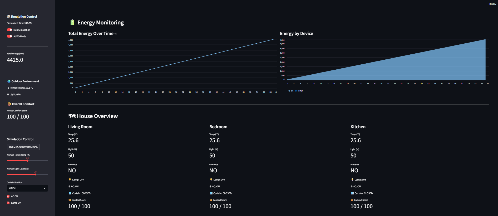
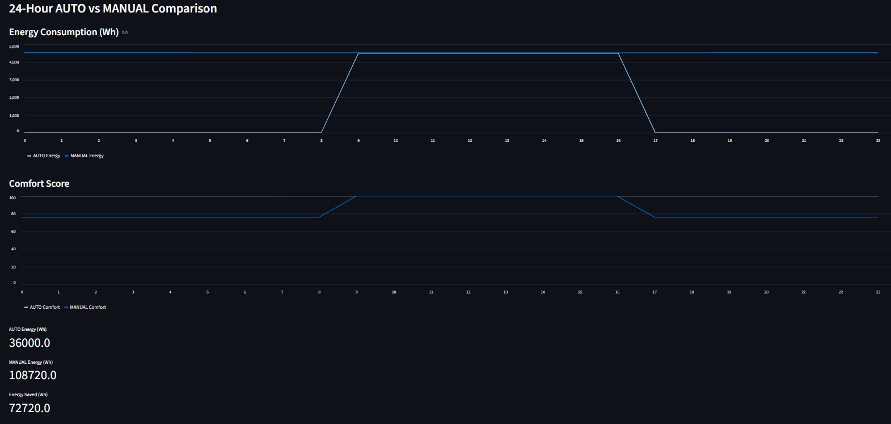

# Smart Home Simulator



A Python + Streamlit Smart Home Simulator that models indoor comfort, energy consumption, and device control. Users can simulate **24-hour AUTO vs MANUAL scenarios**, observe comfort scores, and optimize energy usage.

---

## Table of Contents

- [Overview](#overview)
- [File Structure](#file-structure)
- [Science Behind It](#science-behind-it)
- [Algorithm](#algorithm)
- [Usage](#usage)
- [License](#license)

---

## Overview

This simulator models a multi-room smart home:

- Monitors **temperature, light, and presence** in rooms
- Controls **lamp, AC, and curtains** automatically (or manually)
- Calculates **comfort scores** based on preferences
- Tracks **energy consumption** for AUTO vs MANUAL modes
- Models **24-hour outdoor temperature and light variation**
- Visualizes results in **Streamlit UI** with charts and metrics



---

## File Structure

```text
smart-home-dashboard/
│
├─ core/
│  ├─ models.py          # Room, Lamp, AC, Curtain classes
│  ├─ controller.py      # AutoController logic
│  ├─ energy.py          # Energy monitoring & accumulation
│  └─ simulation.py      # 24h simulation engine (AUTO vs MANUAL)
│
├─ data/
│  └─ preferences.py     # User comfort preferences (temperature, light)
│
├─ images/
│  ├─ dashboard.png      # Example of the Streamlit dashboard
│  └─ energy_chart.png   # Example chart screenshot
│
├─ app.py                # Streamlit main application
└─ README.md             # This file
```

---

## Science Behind It

The simulator uses **basic physics and human comfort models**:

1. **Temperature Dynamics**
   - AC adjusts room temperature toward target
   - If AC is OFF, room temp gradually moves toward **outdoor temp**

2. **Light Dynamics**
   - Indoor light = lamp contribution + outdoor light filtered by curtains
   - Lamp brightness adjustable (0–100%)

3. **Comfort Score**
   - Weighted average of **temperature and light comfort**
   - Presence-aware: empty rooms → full comfort

4. **Energy Consumption**
   - Lamps: `10 W` per hour if ON
   - AC: `1500 W` per hour if ON
   - Cumulative energy tracked hourly

5. **Outdoor Model**
   - Sinusoidal **24-hour model**: temperature & light vary realistically

6. **Occupancy Simulation**
   - Presence simulated based on **time of day** (e.g., office hours absence 9–17)

---

## Algorithm

### AUTO Mode

1. Check **presence**:
   - If empty → turn off lamp, AC ECO mode, close curtains
2. **Lighting Logic**:
   - If indoor light < preference:
     - Open curtains if outdoor light sufficient
     - Else, turn on lamp
3. **Temperature Logic**:
   - If temp > max → AC ON or curtain open (if outdoor cooler)
   - If temp < min → AC OFF, curtains closed
4. **Physics Update**:
   - Temperature and light adjusted toward target values
5. **Energy Calculation**:
   - Lamp and AC energy added to total

### MANUAL Mode

- User sets **temperature, light, AC, lamp, curtains**
- Same physics updates and energy calculation
- Compare comfort & energy with AUTO mode

---

## Usage

1. Clone the repo:
```bash
git clone <repo-url>
cd smart-home-dashboard
```

2. Install dependencies:
```bash
pip install -r requirements.txt
```

3. Run Streamlit dashboard:
```bash
streamlit run app.py
```

4. In the sidebar:
   - Toggle **AUTO Mode** or manual control
   - Adjust temperature, lamp, AC, curtains
   - Run **24-hour simulation** and see energy & comfort charts

5. Observe:
   - House overview per room
   - Hourly energy usage and comfort scores
   - Comparison between AUTO and MANUAL modes

---

## License

This project is licensed under the **GNU General Public License v3.0 (GPLv3)**.

```text
GNU GENERAL PUBLIC LICENSE
Version 3, 29 June 2007

<https://www.gnu.org/licenses/gpl-3.0.en.html>
```

---


*Created by Dr11*
